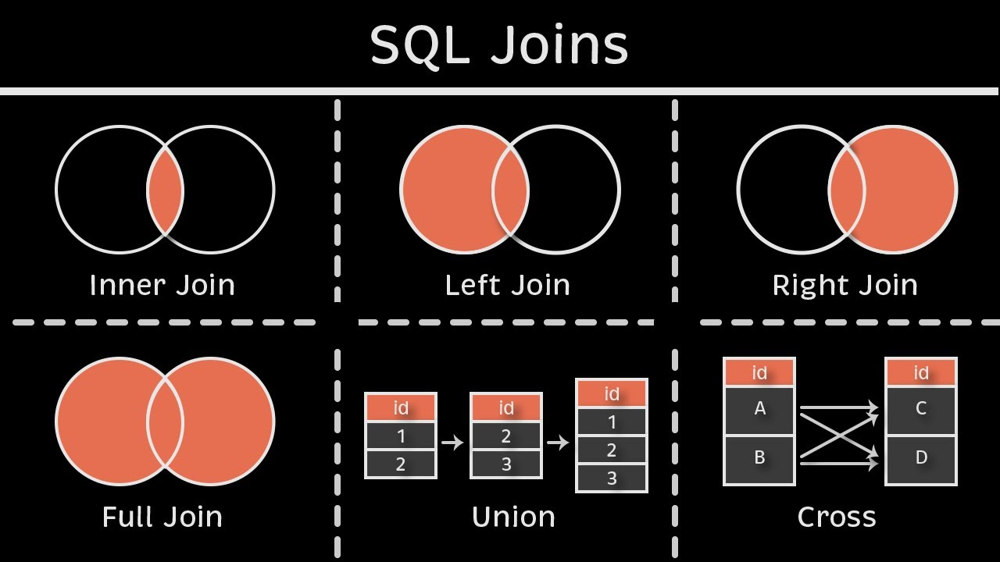

*Here is a graphic representation of SQL Join (focusing on INNER, LEFT, and (FULL OUTER types)). The inner join can be understood by the top left visual where 2 venn diagrams overlap (this is where the 2 tables are similar). Left join is keeping the left circle and where the 2 overlap (left table and where they are similar). Then the full (or outer) join is including everything in the diagram while also inserting "NA" or "None" where data is missing because of the join.*

# SQL Joins Demystified: INNER, LEFT, and OUTER in Action

## Problem Statement

In data science, combining data from multiple tables is common, but choosing the wrong SQL join can lead to incomplete or misleading results. This tutorial helps students understand how INNER, LEFT, and FULL OUTER joins affect outcomes when merging tables (e.g., customers and orders), and guides on selecting the right join for analysis tasks.

## Key Steps/Sections

### 0. SQL Reminders

- **`SELECT`**: Specifies the columns you want to retrieve from your tables. For example, to get an animal's name and species, you'd write `SELECT name, species`. In joins, you'll often select columns from multiple tables, so clarity is key.
- **`FROM`**: Indicates the table(s) you're querying. In a join, you'll list multiple tables here, like `FROM zoo_animals, exhibits`, but we use `JOIN` to link them properly.
- **`ON`**: Defines the condition for matching rows between tables in a join. For example, `ON zoo_animals.animal_id = exhibits.animal_id` links the tables using the `animal_id` column. This is the *glue* that makes joins work.
- **`tableinitial.columnname`**: When working with multiple tables, column names might overlap (e.g., both tables could have an `id` column). To avoid ambiguity, use the table's alias or name followed by a dot, like `zoo_animals.animal_id` or `exhibits.exhibit_name`. Aliases (e.g., `zoo_animals AS z`) make this shorter: `z.animal_id`. This is *critical* for clear, error-free queries.
- **`;` (semicolon)**: Always end your SQL statements with a semicolon. It tells the database your query is complete, like a period in a sentence. Forgetting it can cause errors in some SQL systems (e.g., PostgreSQL), though SQLite is more forgiving.

### 1. Setup: Two Simple Tables
Let's start with two basic tables to illustrate joins. Imagine we have a customers table (with customer details) and an orders table (with purchase records). We'll use a primary key (`customer_id`) in customers that acts as a foreign key in orders.
For this static tutorial, we'll define the tables directly as Markdown tables below. In a real SQL environment (like SQLite, MySQL, or PostgreSQL), you would create these tables using CREATE TABLE and INSERT statements.

**Customers Table:**

| customer_id | name     | email             |
|-------------|----------|-------------------|
| 1           | Alice    | alice@email.com   |
| 2           | Bob      | bob@email.com     |
| 3           | Charlie  | charlie@email.com |
| 4           | Dana     | dana@email.com    |
| 5           | Eve      | eve@email.com     |

**Orders Table:**

| order_id | customer_id | product  | amount |
|----------|-------------|----------|--------|
| 101      | 1           | Laptop   | 1200.0 |
| 102      | 2           | Phone    | 800.0  |
| 103      | 1           | Tablet   | 300.0  |
| 104      | 6           | Monitor  | 200.0  |
| 105      | 3           | Keyboard | 50.0   |

### 2. INNER JOIN: Matching Only
An INNER JOIN returns only rows where there's a match in both tables based on the join condition (e.g., `customer_id`).

```sql
SELECT c.customer_id, c.name, o.order_id, o.product, o.amount
FROM customers c
INNER JOIN orders o ON c.customer_id = o.customer_id;
```

**Expected Result:**

| customer_id | name    | order_id | product  | amount |
|-------------|---------|----------|----------|--------|
| 1           | Alice   | 101      | Laptop   | 1200.0 |
| 1           | Alice   | 103      | Tablet   | 300.0  |
| 2           | Bob     | 102      | Phone    | 800.0  |
| 3           | Charlie | 105      | Keyboard | 50.0   |

Notice: Only matched customers (1,2,3) appear; Dana (4), Eve (5), and the unmatched order (104 for customer 6) are excluded.

### 3. LEFT JOIN: Keep All from Left
A LEFT JOIN keeps all rows from the left table (`customers`), with matching rows from the right (`orders`). Unmatched right-side columns get NULL.

```sql
SELECT c.customer_id, c.name, o.order_id, o.product, o.amount
FROM customers c
LEFT JOIN orders o ON c.customer_id = o.customer_id;
```

| customer_id | name    | order_id | product  | amount |
|-------------|---------|----------|----------|--------|
| 1           | Alice   | 101      | Laptop   | 1200.0 |
| 1           | Alice   | 103      | Tablet   | 300.0  |
| 2           | Bob     | 102      | Phone    | 800.0  |
| 3           | Charlie | 105      | Keyboard | 50.0   |
| 4           | Dana    | None     | None     | None   |
| 5           | Eve     | None     | None     | None   |

Here, all customers are included, with NULLS for Dana and Eve's orders. Unmatched orders (like 104) are dropped. 

### 4. FULL OUTER JOIN: Everything, Everywhere
A FULL OUTER JOIN (or just OUTER JOIN in some dialects) includes all rows from both tables, with NULLs where there's no match. (Note: In SQLite, this is FULL OUTER JOIN; in MySQL, it's emulated with UNION of LEFT and RIGHT joins.)

```sql
SELECT c.customer_id, c.name, o.order_id, o.product, o.amount
FROM customers c
FULL OUTER JOIN orders o ON c.customer_id = o.customer_id;
```

| customer_id | name    | order_id | product  | amount |
|-------------|---------|----------|----------|--------|
| 1           | Alice   | 101      | Laptop   | 1200.0 |
| 1           | Alice   | 103      | Tablet   | 300.0  |
| 2           | Bob     | 102      | Phone    | 800.0  |
| 3           | Charlie | 105      | Keyboard | 50.0   |
| 4           | Dana    | None     | None     | None   |
| 5           | Eve     | None     | None     | None   |
| 6           | None    | 104      | Monitor  | 200.0  |

This shows everything: matched rows, plus unmatched customers (4,5) and the unmatched order (104). 

### 5. Comparing Join Results

This table depicts a summary about SQL Joins based off of the examples we used. 

| Join Type       | Rows Returned | Includes Unmatched Left? | Includes Unmatched Right? | Use Case Example                  |
|-----------------|---------------|--------------------------|---------------------------|-----------------------------------|
| INNER JOIN      | 4             | No                       | No                        | Get only customers with orders    |
| LEFT JOIN       | 6             | Yes (with NULLs)         | No                        | Analyze all customers, including those without orders |
| FULL OUTER JOIN | 7             | Yes (with NULLs)         | Yes (with NULLs)          | Audit all data, spotting orphans in either table |

## Call to Action

### Zoo Animals Table
This table lists animals in a zoo, with `animal_id` as the primary key.

| animal_id | name      | species      |
|-----------|-----------|--------------|
| 1         | Leo       | Lion         |
| 2         | Ellie     | Elephant     |
| 3         | Gina      | Giraffe      |
| 4         | Penny     | Penguin      |
| 5         | Toby      | Tiger        |

### Exhibits Table
This table lists exhibit assignments, with `animal_id` as a foreign key referencing the `zoo_animals` table.

| exhibit_id | animal_id | exhibit_name | area_sqft |
|------------|-----------|--------------|-----------|
| 101        | 1         | Savanna      | 5000      |
| 102        | 3         | Tall Plains  | 3000      |
| 103        | 1         | Big Cats     | 2000      |
| 104        | 6         | Jungle       | 4000      |
| 105        | 2         | Elephant Enclosure | 6000 |

**Notes for Practice**:
- `animal_id` 6 in the `exhibits` table has no match in `zoo_animals` (unmatched right).
- Animals like Penny (4) and Toby (5) in `zoo_animals` have no exhibits (unmatched left).
- Use these tables to practice joins in an SQL editor like [DB-Fiddle](https://www.db-fiddle.com/) by creating them with `CREATE TABLE` and `INSERT` statements, similar to the SQL snippets in the previous tutorial.